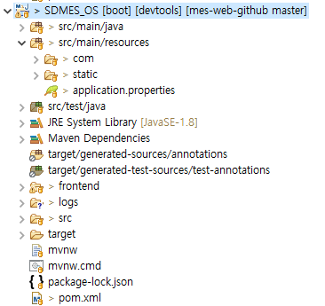
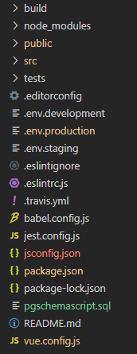
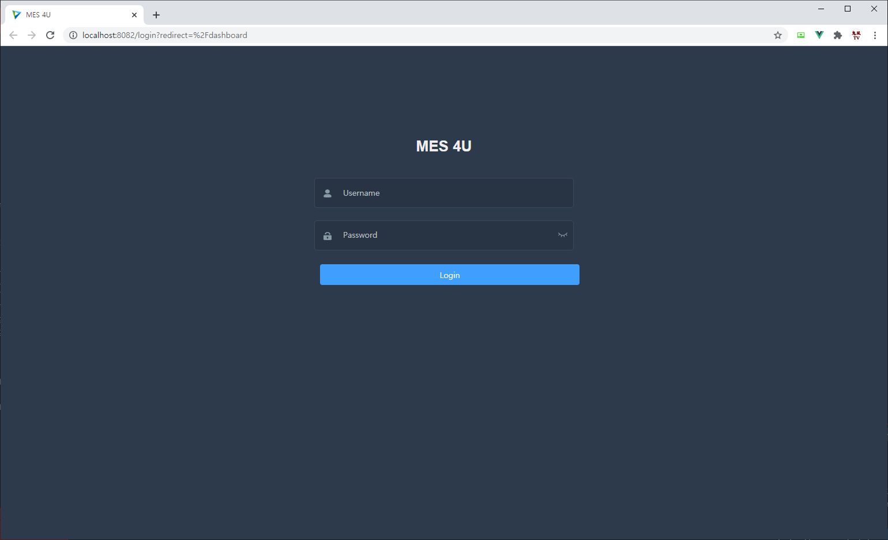
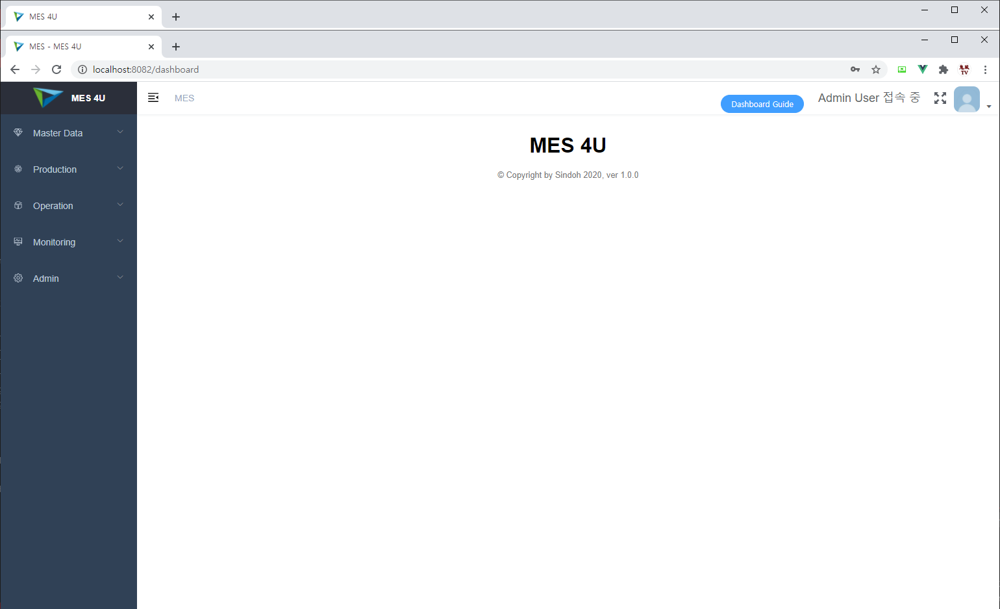

# Getting Started - Installation

[Eng](Installation.md) / 한글

## I. Clone Repository

소스코드 다운로드는 아래와 같습니다.

```
git clone https://github.com/sindohmes/mes4u.git
```

## II. PostgreSQL Setup

만약 PostgreSQL이 설치되어 있지 않다면, 먼저 PostgreSQL을 설치해주시기 바랍니다.
현재까지 테스트 된 버전은 아래와 같으며, 추가 버전 테스트가 필요할 경우 목록에 추가하겠습니다.

+ PostgreSQL 9.6.18 (OS: Red Hat 4.8.5-39, 64-bit)
+ PostgreSQL 9.6.19 (OS: Windows 10, 64-bit)
+ PostgreSQL 12.4 (OS: Windows 10, 64-bit)
+ PostgreSQL 17.7 (OS: Windows 11, 64-bit)

[PostgreSQL 다운로드 링크](https://www.postgresql.org/download/)

다운로드 및 설치가 완료되면, pgAdmin을 실행하신 후 사용자 및 DB를 생성합니다.
사용자 및 DB 생성은 아래 명령어를 실행합니다.

```PostgreSQL
CREATE USER mesuser PASSWORD 'your_db_password';
CREATE DATABASE nsmes OWNER 'mesuser';
ALTER DATABASE nsmes SET search_path TO nsmes;
```

Schema 생성 스크립트는 'nsmes' 스키마를 생성하므로, DB의 search_path는 위와 같이 'nsmes'로 지정해야 합니다.

명령어 실행 시 상기 코드의 'mesuser' 및 'nsmes'는 사용자가 직접 수정해서 관리할 수 있으나, DB Schema 생성 스크립트 및 Spring의 application.properties 파일도 이에 맞춰서 수정을 해야 하니 주의 바랍니다. (DB 이름은 자유롭게 지정할 수 있으나, search_path는 스크립트의 스키마 이름과 일치해야 합니다.)

사용자 및 DB 생성이 완료되었으면, 다음은 Schema 생성 스크립트를 다운로드 받으신 후, PostgreSQL에서 실행합니다. 스크립트에는 Table, View, Sequence, Function, Index 등을 포함하여 필수 데이터 Insert 구문을 포함합니다. PostgreSQL에서 실행할 때에는 처음에 접속했던 postgres 계정이 아닌, 위에서 생성한 mesuser 계정으로 실행해야 합니다.

[PostgreSQL Schema Creation Script 다운로드 링크](./pgschemascript.sql)

## III. Java Spring Framework Setting

mes4u는 오픈소스로 제공되므로, Java 언어의 Spring Framework에서 가동됩니다. 

구동 환경은 Gradle Project(Spring Boot 2.7, Java 17) 기반으로 구성되어 있습니다.

빌드 및 실행을 위해 JDK 17이 필요합니다. JDK 17을 설치한 후 JAVA_HOME 또는 IDE의 Gradle JVM 설정을 JDK 17로 지정해 주세요. Gradle은 별도로 설치하지 않아도 되며, 프로젝트에 포함된 Gradle Wrapper(gradlew)가 자동으로 내려받습니다.

프로젝트의 디렉토리 구조는 다음과 같습니다.



+ src/main/java: Back-end Java 소스
+ src/main/resources/com: MyBatis XML 
+ src/main/resources/static: Front-end Vite Build용 배포 디렉토리
+ src/main/resources/application.properties: Spring 환경설정 및 PostgreSQL 연결 설정
+ frontend: Front-end Vue.js 소스 및 환경
+ build: WAR, Class 등 배포 디렉토리 (Gradle 빌드 시 생성)
+ build.gradle: Gradle Project 환경설정 파일
+ settings.gradle: Gradle Project 이름 설정 파일
+ gradlew, gradlew.bat, gradle: Gradle Wrapper

위 디렉토리 및 파일에서 설정 파일은 application.properties, build.gradle로, 다음 사항을 확인합니다.

### 1. application.properties

Spring Framework 환경설정 값을 지정하는 파일로, 주로 PostgreSQL 연결 시 사용합니다.

> **참고:** 'application.properties'는 각자의 DB 계정 및 JWT 비밀키가 들어가는 파일이므로 git에 저장하지 않습니다('.gitignore'에 등록됨). 최초 실행 전에 아래와 같이 견본 파일을 복사하여 직접 생성하십시오.
>
> ```
> cp src/main/resources/application.properties.example src/main/resources/application.properties
> ```
>
> (Windows: `copy src\main\resources\application.properties.example src\main\resources\application.properties`) 복사한 파일에서 DB URL, 사용자, 비밀번호 및 'sdmes.app.jwtSecret' 값을 환경에 맞게 수정합니다.

```
spring.datasource.hikari.maximum-pool-size=4
spring.datasource.url=jdbc:postgresql://localhost:5433/nsmes
spring.datasource.username=mesuser
spring.datasource.password=your_db_password

spring.datasource.tomcat.max-wait=10000
spring.datasource.tomcat.max-active=20

spring.jpa.properties.hibernate.jdbc.lob.non_contextual_creation= true
spring.jpa.properties.hibernate.dialect= org.hibernate.dialect.PostgreSQLDialect
spring.jpa.open-in-view=false

# Hibernate ddl auto (create, create-drop, validate, update)
spring.jpa.hibernate.ddl-auto= update
spring.data.jdbc.repositories.enabled=false

mybatis.mapper-locations=com/sindoh/sdmes/mapper/*.xml

# Project Custom Values
sdmes.datasource.db=nsmes
sdmes.app.jwtSecret=change-this-to-a-long-random-string
sdmes.app.jwtExpirationMs=86400000
```

위 코드에서 postgresql 연결에 사용할 주소 및 DB, 접속 계정을 설정할 수 있습니다. spring.datasource.url의 포트(5433)와 DB 이름(nsmes)은 사용하는 PostgreSQL에 맞게 변경하세요(PostgreSQL 기본 포트는 5432). sdmes.datasource.db는 레포트(라벨 출력) 프로시저에 전달되는 DB 이름이므로 URL의 DB 이름과 동일하게 지정하며, DB 연결 자체에는 사용되지 않습니다.

### 2. build.gradle

Spring Boot - Gradle Project에서 사용할 라이브러리를 나타내며, 현재는 다음 라이브러리를 사용합니다.

+ Spring JDBC
+ Spring JPA
+ Spring Security
+ Spring MyBatis
+ JsonWebtoken
+ Jackson
+ Devtools
+ PostgreSQL
+ Lombok
+ Swagger-UI (springdoc-openapi)

특별한 변경 사항은 없으며, 추가로 라이브러리를 사용해서 변경하고 싶을 경우에는 build.gradle 파일의 dependencies에 추가 후, IDE에서 Gradle - Refresh Gradle Project(또는 임의의 Gradle 작업 실행)를 통해서 라이브러리를 다운로드 및 사용할 수 있습니다.

Swagger-UI 화면은 http://localhost:8080/swagger-ui.html, API 문서(OpenAPI)는 http://localhost:8080/v3/api-docs 에서 확인할 수 있습니다.

참고: JWT 서명 키는 sdmes.app.jwtSecret 값을 SHA-512로 변환하여 생성합니다. 충분히 긴 임의의 문자열로 설정하고, 환경마다 서로 다른 값을 사용하세요.

## IV. Vue.js Setting

mes4u의 Front-end Framework는 Vue.js를 사용하며, 설치 및 관리는 npm을 사용합니다. npm을 사용할 수 없는 경우에는 node.js를 설치해야 하며, 아래 링크를 통해서 다운로드를 할 수 있습니다.

[Node.js 다운로드 링크](https://nodejs.org/ko/) (Vite 사용을 위해 Node.js 20.19 이상 또는 22.12 이상이 필요합니다)

현재는 Java WAR 파일 및 Vue.js 배포 Build 파일이 이미 업로드되어 있으므로, Front-end 소스코드를 수정하거나 추가하지 않고 단순 열람 및 테스트 용도로 사용할 경우에는 별도의 설정을 하지 않아도 됩니다. 하지만 Vue.js 코드 수정을 위해서는 다음과 같은 절차를 따릅니다.

+ Vue.js 개발환경 설치
```
npm install
```

+ Vue.js 개발환경 실행
```
npm run dev
```

+ Vue.js Build 및 배포
```
npm run build
```

Vue.js 환경은 다음의 구조를 따릅니다.



+ build: 빌드에 사용, 수정하지 않음
+ node_modules: 개발환경 설치 시 생성됨, Git에는 해당 디렉토리가 존재하지 않음
+ public: HTML 조회 파일, 수정하지 않음
+ src: Vue.js 개발 소스코드 파일, 모든 코드의 추가 및 수정은 해당 디렉토리에서 수행
+ package.json: Vue.js에서 사용할 라이브러리 및 환경 설정 파일
+ vite.config.js: 개발 및 배포환경 설정 관련 파일
+ .env.development: 개발 환경에서 Back-end API에 연결하기 위한 Base URL 지정 파일
+ .env.production: 배포 환경에서 Back-end API에 연결하기 위한 Base URL 지정 파일

mes4u의 Vue.js는 다음 UI 및 Template을 사용합니다.

+ [Element Plus: MIT License](https://element-plus.org)
+ [vue-element-admin: MIT License](https://github.com/PanJiaChen/vue-element-admin)

## V. mes4u 실행

mes4u 실행은 STS4(Spring Tool Suite)의 Spring Boot App 또는 Gradle을 통해서 실행하거나, 혹은 build/libs 디렉토리의 ROOT.war 파일을 실행합니다.

```
./gradlew bootRun
```

WAR 파일(build/libs/ROOT.war)을 생성하여 실행하려면 다음과 같이 합니다.

```
./gradlew bootWar
java -jar build/libs/ROOT.war
```

Windows에서는 ./gradlew 대신 gradlew.bat을 사용합니다.

기본 설정 주소는 http://localhost:8080 을 사용하며, 특정 서버에서 사용하기 위해서는 Tomcat Server에서 가동시킵니다.

http://localhost:8080 으로 접속하면 다음 화면이 나타납니다.



PostgreSQL 설치 및 DB 연결 설정이 완료될 경우 정상적으로 페이지가 조회될 것이며, 기본 설정 된 계정은 다음과 같습니다.

+ ID: administrator
+ PW: administrator

접속이 완료되면 메인 페이지가 나타날 것이며, MES Web의 다양한 기능을 이용할 수 있습니다.


